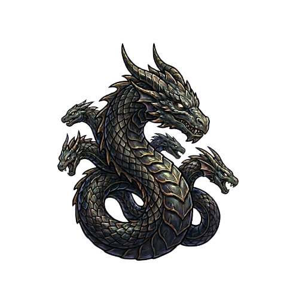

# Morpheus

<p align="center">
  
</p>

Go-based Windows x64 C2 agent for [Mythic](https://github.com/its-a-feature/Mythic). Named after Morpheus, the god of dreams.

## Features

### Core
- **Language**: Go 1.22, cross-compiled to native Windows x64 PE
- **Output**: Single monolithic PE (~5.9 MB garble-obfuscated), no stager
- **Protocol**: HTTP/HTTPS via Go `net/http`
- **Encryption**: AES-256-GCM (`crypto/aes` + `crypto/cipher`)
- **Architecture**: 32 commands, Mythic-compatible payload type

### Evasion

| Technique | Implementation | File |
|---|---|---|
| **String obfuscation** | All function names resolved by DJB2 hash (pre-computed constants). All error messages stored as XOR-encrypted byte arrays. | `apihash.go`, `obfuscate.go` |
| **API resolution** | PEB walking via assembly (`readgs_amd64.s`) reads `PEB.Ldr.InLoadOrderModuleList`, walks module list, hashes module names, finds export by hash. | `obfuscate.go:resolveAPI()` |
| **No `golang.org/x/sys/windows`** | All Win32 calls via raw `syscall.SyscallN` with hash-resolved pointers. | `syscalls_windows.go` |
| **Direct syscalls** | Plan9 assembly stubs (`syscall4`, `syscall5`) bypass ntdll for critical operations. SSN extracted dynamically from clean ntdll on disk. | `direct_syscall_amd64.s`, `unhook.go` |
| **ntdll unhooking** | Reads `C:\Windows\System32\ntdll.dll` from disk, finds `.text` section, copies clean code over hooked in-memory section via direct `NtProtectVirtualMemory` syscall. | `unhook.go:UnhookNtdll()` |
| **ETW patching** | Locates `EtwEventWrite` in ntdll's export table by hash, patches first byte with `ret` (0xC3) via direct syscall. | `unhook.go:PatchETW()` |
| **AMSI patching** | Locates `amsi.dll` in PEB, finds `AmsiScanBuffer` export by hash, patches with `ret`. | `unhook.go:PatchAMSI()` |
| **Sleep masking** | XOR-encrypts the AES key before `time.Sleep()`, decrypts on wake. Hides credential material during idle. | `sleepmask.go` |
| **Go symbol obfuscation** | Built with `garble -seed=random` to strip Go runtime package paths, type names, function names. | `build.sh` |

### Injection

| Technique | Use case | File |
|---|---|---|
| **Early Bird APC** | Shellcode injection (no PID specified): `CreateProcessW` (suspended) -> `VirtualAllocEx` -> `WriteProcessMemory` -> `QueueUserAPC` -> `ResumeThread` | `syscalls_windows.go:spawnEarlyBird()` |
| **CreateRemoteThread** | Shellcode injection (PID specified): `OpenProcess` -> `VirtualAllocEx` -> `WriteProcessMemory` -> `VirtualProtectEx` -> `CreateRemoteThread` | `syscalls_windows.go:SpawnShellcode()` |
| **Process Hollowing** | Full PE execution: `CreateProcessW` (suspended) -> `NtQueryInformationProcess` -> `ReadProcessMemory` (PEB) -> `NtUnmapViewOfSection` -> `VirtualAllocEx` -> `WriteProcessMemory` (sections) -> `SetThreadContext` -> `ResumeThread` | `syscalls_windows.go:ProcessHollowing()` |

### Commands

| Category | Commands |
|---|---|
| Execution | `shell`, `run` |
| File Ops | `cd`, `pwd`, `ls`, `cat`, `cp`, `mv`, `rm`, `mkdir`, `download`, `upload` |
| Process | `ps`, `kill` |
| Info | `getuid`, `whoami`, `ifconfig` |
| Evasion | `blockdlls`, `spawnto` |
| Token | `make_token`, `steal_token`, `rev2self`, `runas` |
| Injection | `spawn` (shellcode via APC/CRT), `execute_assembly` (.NET) |
| Pivot | `socks`, `rportfwd`, `ligolo_start/stop/status` |
| Agent | `sleep`, `exit` |

## Architecture

```
Morpheus/
├── payload-type/morpheus/agent_code/  # Go source -- the agent binary
│   ├── main.go                   # Entry -> initAPI -> InitEvasion -> agent.Run
│   ├── agent.go                  # Agent struct, beacon loop (checkin -> get_tasking -> execute -> sleep)
│   ├── crypto.go                 # AES-256-GCM (crypto/aes + crypto/cipher)
│   ├── rpc.go                    # Mythic protocol (EncodeMessage / DecodeMessage)
│   ├── obfuscate.go              # xorEncrypt/xorDecrypt, DJB2 hashUpper, resolveAPI, PEB/LDR types
│   ├── apihash.go                # Pre-computed DJB2 hashes + proc pointers + initAPI()
│   ├── direct_syscall_amd64.s    # Assembly direct syscall stubs (syscall4, syscall5)
│   ├── readgs_amd64.s            # Assembly to read PEB from GS segment
│   ├── unhook.go                 # ntdll unhooking, ETW patching, AMSI patching
│   ├── syscalls_windows.go       # All Win32 wrappers (SpawnShellcode, ProcessHollowing, etc.)
│   ├── sleepmask.go              # Sleep masking (XOR encrypts AES key during sleep)
│   ├── {command}.go              # Per-command implementations (shell.go, download.go, socks.go...)
│   ├── build.sh                  # Cross-compile with garble
│   └── go.mod
├── payload-type/morpheus/         # Mythic payload type
│   ├── __init__.py
│   ├── Dockerfile
│   ├── morpheus.py               # Python builder (injects C2 config via -ldflags -X)
│   └── mythic/                   # Command definitions, browser scripts
├── c2_profiles/http/              # HTTP C2 profile for Mythic
├── agent_icons/                   # SVG icon
├── documentation-payload/         # Agent documentation
├── documentation-wrapper/         # Wrapper documentation
├── config.json                    # Mythic install config
├── agent_capabilities.json        # Command registry
└── tools/                         # External tooling
```

### Initialization flow

```
main()
  -> initAPI()          # resolve all Win32 proc pointers via PEB walking + DJB2 hashes
  -> InitEvasion()      # unhook ntdll -> patch ETW -> patch AMSI
  -> InitSleepMask()    # seed sleep mask state
  -> NewAgent()         # create agent struct with C2 config, generate AES key
  -> agent.Run()
       -> checkin()          # POST encrypted checkin to C2
       -> loop: get_tasking() -> execute() -> post_response() -> sleep()
```

### Obfuscation model

All Win32 API calls resolve at runtime via:

```
resolveAPI(moduleHash, functionHash)
  -> readPEB()                     # GS segment -> _PEB
  -> PEB.Ldr.InLoadOrderModuleList # walk loader entries
  -> hash module name            # DJB2(uppercase)
  -> match moduleHash -> get DllBase
  -> parse PE export table       # IMAGE_EXPORT_DIRECTORY
  -> hash each export name       # DJB2(uppercase)
  -> match fnHash -> return function address
```

Every module name and function name is stored as a pre-computed 32-bit hash constant in `apihash.go`. No strings survive compilation.

## Installation (Mythic)

```bash
# From your Mythic instance:
sudo ./mythic-cli install folder /path/to/Morpheus
```

## Building

```bash
cd agent/
./build.sh [output_name.exe]
```

### Build Parameters

| Parameter | Type | Default | Description |
|---|---|---|---|
| `c2_url` | String | `https://127.0.0.1:443` | C2 callback URL |
| `callback_interval` | Number | 5 | Callback interval (seconds) |
| `callback_jitter` | Number | 10 | Jitter percentage (0-100) |
| `agent_uuid` | String | auto-generated | Agent UUID |
| `encryption_key` | String | auto-generated | AES-256 key (base64) |

## Notes

- Built and tested with Go 1.22.3
- Uses `garble` v0.12 for Go symbol obfuscation
- All offensive operations assumed authorized. Scope: HTB, RootMe, TryHackMe, PortSwigger Academy, authorized penetration tests.
- Strings like `CreateProcessW`, `GetComputerNameW` visible in the binary come from Go's standard library (syscall package), not from agent code.
